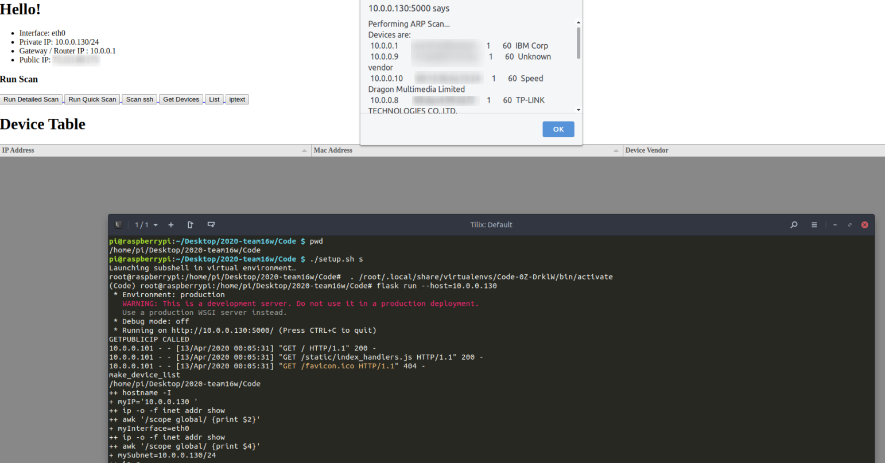
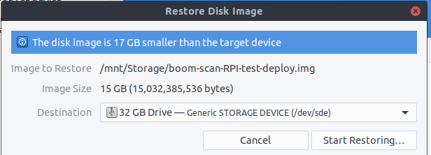
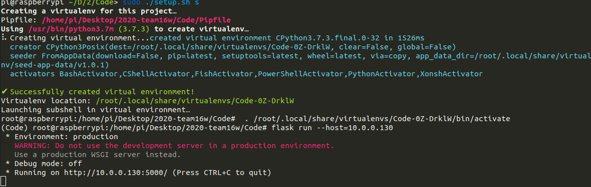
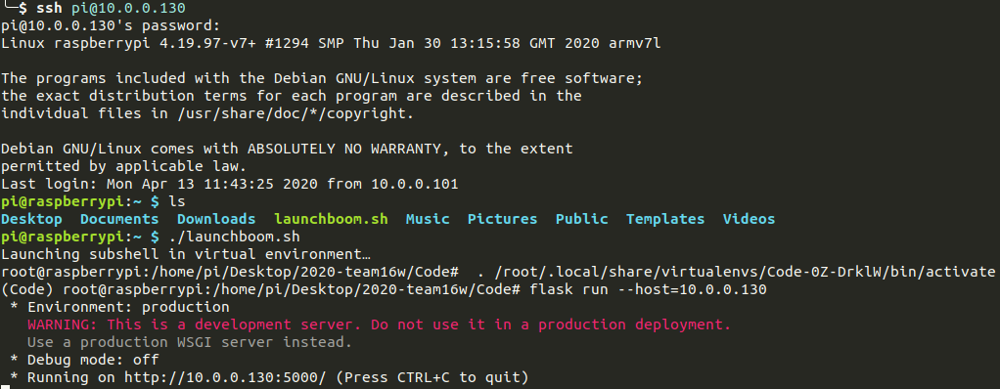
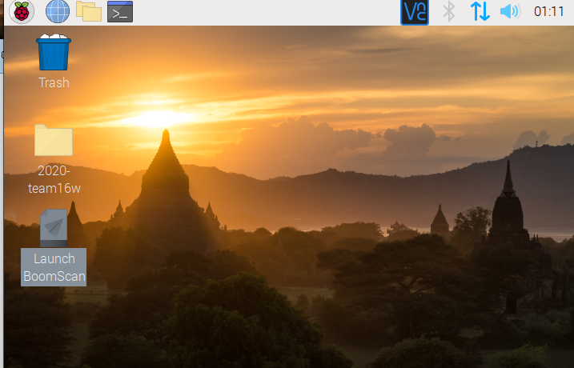
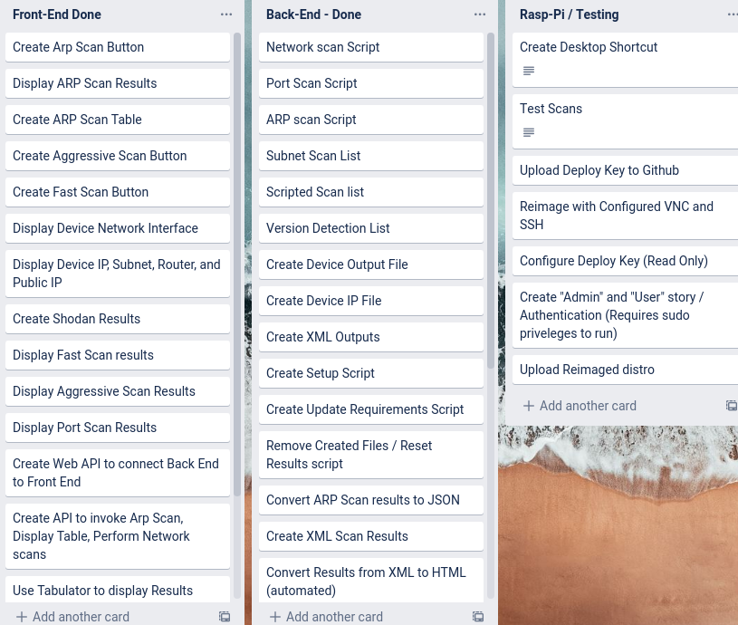

# Sprint 4

## UI / UX

The Top half indicates generating a list on the front end. The bottom Half indicates what goes on in the back end.

### Home Screen

Looking at the back end, we see that the first method to start the project is ./setup.sh s. This is script is used to start the project. by doing  ./setup.sh c, the Admin can clear saved results. The terminal output indicates each command that done in the back end to perform the task.

### Running A Scan

The top indicates a user clicking to run a scan. They receive an alert when the scan is done.

The bottom Indicates what occurs in the back end. The user int

### Displaying Results

The output here is mainly for back end testing. From the terminal we see the user selects an ssh port scan, we see which directory that the back end is working in. We also see that there is a HTTP status Code 200. This indicates that the request from the front end was fulfiled.

## Displaying Scan Output

This is what One of the Outputs look like. In the back end, we see that there is a 404 on displaying Fast scan results. This is because there was no fast scan initiated, so there would be  no results to display. We also see that there is another HTTP status Code 200 for the scan. This indicates that an HTML page was generated from the successful scan.

## Infrastructure

The device is designed to pull the IP Address from DHCP. We can see from the first screenshot how the network is configured. Under "Hello!" We see the Interface, the IP Address and subnet, The Router IP and Public IP. This is important since it defines the project scope. The scanner will look for devices connected to the home network. The Public IP is used in case there may be potential misconfigured devices on the Network. By checking the Public IP, We can build a greater understanding about our threat surface.

## Deploying Disk Image

The image was shrunk from 32gb to 15gb to allow flexibility for SD Cards.

## Shareable link to Download configured image

Currently, the Distro is available to download for all those who have an IIT email.

[Download Link Here](https://drive.google.com/open?id=1VkWLFhh_3iPu2vYr3kx_lb-SHk-QeT-l)

## Developer

### Install Script

Config setup

This installing and configuring the project for the first time using a rasbperry pi

## Build via SSH

This indicates that a user can ssh into the raspberry PI and launch the project within the home directory. This creates another simple way to start vulnerability scans remotely.

## Access Using VNC Server

Raspberry Pi's by defualt come with VNC server, In case the user would like to Interact Directly with the Raspberry Pi via a GUI, they can connect using VNC. From there, the Admin can start the scanner by clicking on a Desktop Shortcut to launch the project. This is the third method used to start the project. All three methods allow the admin to launch the project without hassle.

## Project Manager

I am the Project Manager, Developer, Infrastructure, Security, and UI/UX

### Trello Board

